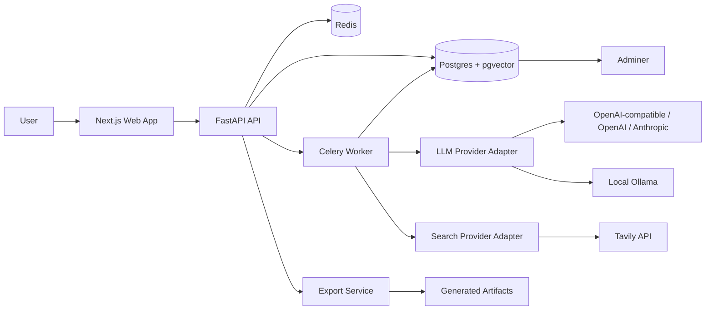
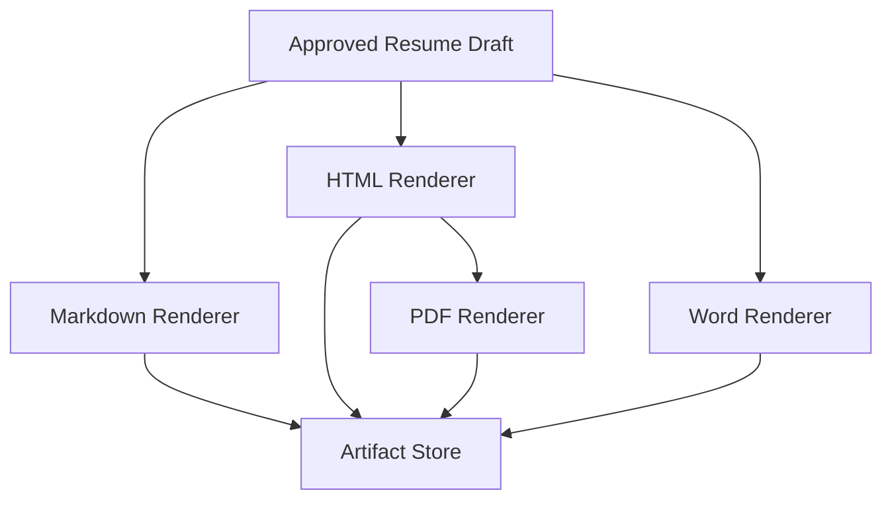

# System Architecture

## Architectural Summary

CV Master is a local-first web application with a Python backend, a Next.js frontend, Postgres storage, and modular agent workflows.

The MVP is single-user, but the architecture avoids assumptions that would prevent future evolution into a specialized personal career assistant.

## High-Level Diagram

## Backend

Use FastAPI as the HTTP API layer because it is a mature Python API framework with type-driven request validation and OpenAPI support.

Backend modules:

- `api`: route definitions and dependency wiring.
- `core`: settings, logging, security, errors.
- `db`: SQLAlchemy sessions, migrations, repositories.
- `models`: database models.
- `schemas`: Pydantic request and response schemas.
- `knowledge`: profile storage, vault sync, retrieval, embeddings.
- `agents`: LangGraph workflows and agent state.
- `llm`: provider adapters.
- `search`: Tavily and future search adapters.
- `exports`: Markdown, HTML, PDF, and Word generation.
- `workers`: Celery tasks.

## Agent Runtime

Use LangGraph for workflow orchestration. The resume generation process has multiple stateful stages, review gates, and retry paths. LangGraph is a better fit than a single prompt chain because it supports explicit state transitions and future human-in-the-loop workflows.

## Database

Use Postgres with pgvector:

- Relational data for career facts and resume versions.
- Vector embeddings for semantic retrieval.
- Full-text search for ATS keywords and exact phrase matching.

## Background Jobs

Use Celery with Redis for:

- JD analysis.
- Embedding generation.
- Resume generation.
- Export rendering.
- External search calls.

This keeps long-running agent work out of normal HTTP request timeouts.

## Frontend

Use Next.js with React and TypeScript:

- App Router for page organization.
- Tailwind CSS and shadcn/ui for a polished tool interface.
- TanStack Query for API state.
- Zustand for local UI state.
- React Hook Form and Zod for complex forms.

## Export Pipeline

The recommended export pipeline:

MVP implementation may use HTML as the styling source for PDF and Word exports, but the internal resume representation should stay format-independent.

## Local Deployment

Docker Compose should include:

- `api`
- `web`
- `worker`
- `postgres`
- `redis`
- `adminer`

Adminer must be treated as a local development tool.

## References

- FastAPI: https://fastapi.tiangolo.com/
- LangGraph: https://docs.langchain.com/oss/python/langgraph
- Next.js App Router: https://nextjs.org/docs/app
- Celery: https://docs.celeryq.dev/en/stable/
- Adminer: https://www.adminer.org/
