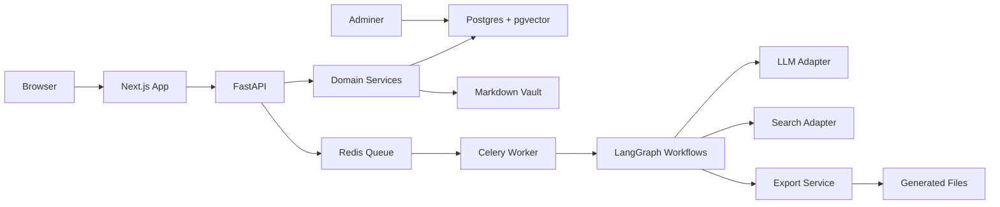

# System Architecture

## Architectural Style

CV Master should use a modular monorepo architecture:

- Frontend web app for workflows and editing
- Backend API for domain operations
- Worker service for slow agent/export tasks
- Postgres as the source of truth
- Markdown vault as local-readable memory
- Provider adapters for LLMs and search

## High-Level Diagram

## Backend Components

### API Layer

FastAPI exposes REST endpoints for career data, generation jobs, templates, exports, and settings. It should return typed Pydantic schemas and avoid leaking ORM models.

### Domain Services

Domain services contain business logic for profiles, experiences, projects, evidence, resumes, templates, retrieval, and exports. They should not depend directly on FastAPI request objects.

### Agent Runtime

LangGraph coordinates resume generation workflows. Nodes should be deterministic where possible and should save intermediate outputs for auditability.

### Retrieval Engine

Retrieval combines:

- Postgres full-text search for exact terminology and ATS keywords
- pgvector semantic search for related projects and achievements
- metadata filters for dates, roles, industries, skills, and evidence confidence
- reranking based on JD requirement priority

### Export Service

Export should render from a structured resume document model. Markdown is the canonical text draft; HTML, PDF, and DOCX are rendered from the structured model and template.

### Provider Adapters

LLM and search integrations must be hidden behind internal interfaces. This keeps the app portable across cloud APIs and local Ollama.

## Database Choice

Use Postgres with pgvector. This keeps structured data, audit records, full-text search, and vector search in one database for the MVP.

## Markdown Vault Choice

The vault should contain readable career notes and generated artifacts. It is not a replacement for Postgres. The vault makes the system more local-first, portable, and compatible with tools such as Obsidian.

## Async Work

Use Celery for:

- embedding refresh
- JD analysis
- resume generation
- export rendering
- Tavily enrichment
- batch vault sync

## Observability

MVP observability should include:

- structured logs
- generation run status
- model/provider metadata
- prompt version
- token usage when available
- task durations
- export errors

## Evolution To Personal Career Assistant

The architecture leaves room for phase 2:

- Multiple agent workflows under one runtime
- Long-term memory and knowledge graph expansion
- Tool registry for career-specific tools
- Optional desktop/local integrations
- Profile scoping for future multi-profile support without SaaS-first design

