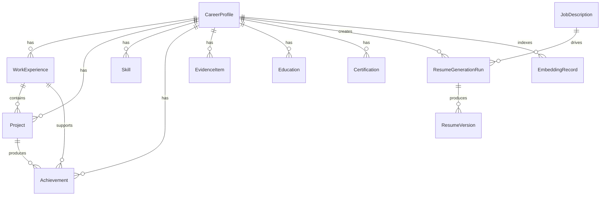

# Data Model

## Design Principles

- Store career facts in structured tables.
- Store AI-generated resume outputs separately from source facts.
- Preserve evidence references for every important generated claim.
- Support semantic search and keyword search.
- Keep future profile scoping possible even though MVP is single-user.

## Core Entities

### CareerProfile

Represents the user's overall career profile.

Fields:

- id
- display_name
- target_titles
- location
- contact_details
- summary_notes
- created_at
- updated_at

### WorkExperience

Represents employment history.

Fields:

- id
- profile_id
- company
- title
- location
- start_date
- end_date
- employment_type
- description
- technologies
- source_confidence

### Project

Represents professional, academic, open-source, or personal projects.

Fields:

- id
- profile_id
- work_experience_id nullable
- name
- role
- domain
- start_date
- end_date
- description
- technologies
- outcomes
- metrics
- links
- source_confidence

### Achievement

Represents measurable career accomplishments.

Fields:

- id
- profile_id
- work_experience_id nullable
- project_id nullable
- statement
- metric_value nullable
- metric_unit nullable
- impact_area
- evidence_ids
- source_confidence

### Skill

Represents a skill or technology.

Fields:

- id
- profile_id
- name
- category
- proficiency
- years_used nullable
- last_used_at nullable
- aliases

### Education

Represents education history.

Fields:

- id
- profile_id
- institution
- degree
- field
- start_date
- end_date
- honors
- notes

### Certification

Represents certifications and credentials.

Fields:

- id
- profile_id
- name
- issuer
- issued_at
- expires_at nullable
- credential_id nullable
- url nullable

### EvidenceItem

Represents source material used to substantiate claims.

Fields:

- id
- profile_id
- type
- title
- content
- url nullable
- file_path nullable
- related_entity_type
- related_entity_id
- confidence
- created_at

### JobDescription

Represents an input job description.

Fields:

- id
- title
- company nullable
- raw_text
- source_url nullable
- parsed_requirements
- ats_keywords
- seniority
- created_at

### ResumeGenerationRun

Represents one generation attempt.

Fields:

- id
- profile_id
- job_description_id
- status
- llm_provider
- llm_model
- prompt_version
- strategy_json
- selected_evidence_json
- critique_json
- error_message nullable
- created_at
- completed_at nullable

### ResumeVersion

Represents a saved resume output.

Fields:

- id
- run_id
- title
- structured_document_json
- markdown_content
- html_content nullable
- source_references_json
- ats_score nullable
- created_at

### ResumeTemplate

Represents a template for rendering.

Fields:

- id
- name
- format_type
- ats_safe
- template_path
- style_config_json

### EmbeddingRecord

Represents searchable embeddings for entities and evidence.

Fields:

- id
- profile_id
- entity_type
- entity_id
- chunk_text
- embedding
- embedding_model
- metadata_json
- created_at

## Relationship Diagram

## Source Confidence

Use confidence levels to help the agent avoid weak claims:

- `verified`: user-confirmed or backed by strong evidence
- `user_provided`: directly entered by the user
- `inferred`: inferred by the system and pending user review
- `draft`: generated suggestion only

Generated resumes should prefer `verified` and `user_provided` facts.

