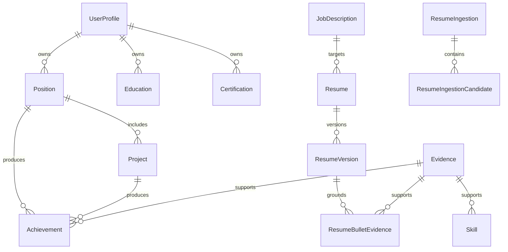

# Data Model

## Design Principles

- Store career facts as structured records.
- Keep generated resume content versioned.
- Preserve evidence links between generated claims and source data.
- Support semantic retrieval and keyword retrieval.
- Avoid multi-user complexity in the MVP, but keep ownership fields easy to add later.

## Core Entities

### UserProfile

Represents the single user's professional identity.

Fields:

- `id`
- `full_name`
- `headline`
- `location`
- `email`
- `phone`
- `links`
- `default_summary`
- `created_at`
- `updated_at`

### Position

Represents employment or professional role history.

Fields:

- `id`
- `company`
- `title`
- `employment_type`
- `location`
- `start_date`
- `end_date`
- `is_current`
- `description`
- `tech_stack`
- `source_note_id`
- `created_at`
- `updated_at`

### Project

Represents projects from work, open source, education, consulting, or personal work.

Fields:

- `id`
- `title`
- `organization`
- `role`
- `summary`
- `start_date`
- `end_date`
- `skills`
- `tools`
- `domain`
- `impact`
- `position_id`
- `source_note_id`
- `created_at`
- `updated_at`

### Achievement

Represents quantifiable or qualitative outcomes.

Fields:

- `id`
- `title`
- `description`
- `metric_name`
- `metric_value`
- `metric_unit`
- `before_state`
- `after_state`
- `confidence`
- `position_id`
- `project_id`
- `evidence_ids`
- `created_at`
- `updated_at`

### Skill

Represents a skill, tool, technology, or domain capability.

Fields:

- `id`
- `name`
- `category`
- `proficiency`
- `years_experience`
- `last_used_at`
- `aliases`
- `evidence_ids`
- `created_at`
- `updated_at`

### Education

Fields:

- `id`
- `institution`
- `degree`
- `field`
- `start_date`
- `end_date`
- `location`
- `details`

### Certification

Fields:

- `id`
- `name`
- `issuer`
- `issued_at`
- `expires_at`
- `credential_id`
- `url`
- `details`

### Evidence

Represents the grounding material for claims.

Fields:

- `id`
- `type`
- `title`
- `description`
- `url`
- `file_path`
- `source_note_id`
- `confidence`
- `created_at`
- `updated_at`

Evidence types:

- `user_statement`
- `document`
- `portfolio_link`
- `metric`
- `manager_feedback`
- `public_artifact`
- `generated_suggestion`

### JobDescription

Fields:

- `id`
- `title`
- `company`
- `raw_text`
- `source_url`
- `analysis`
- `created_at`
- `updated_at`

### Resume

Represents one resume generated for one target.

Fields:

- `id`
- `job_description_id`
- `title`
- `target_role`
- `strategy`
- `status`
- `created_at`
- `updated_at`

### ResumeVersion

Fields:

- `id`
- `resume_id`
- `version_number`
- `content_json`
- `markdown`
- `html`
- `ats_score`
- `review_notes`
- `created_at`

### ResumeBulletEvidence

Links generated bullets to evidence records.

Fields:

- `id`
- `resume_version_id`
- `section`
- `bullet_index`
- `bullet_text`
- `evidence_id`
- `confidence`

### Embedding

Fields:

- `id`
- `entity_type`
- `entity_id`
- `text`
- `embedding`
- `embedding_model`
- `created_at`

### ResumeIngestion

Represents one PDF resume upload and extraction session. Tracks ingestion progress and candidate review state.

Fields:

- `id`
- `source_filename`
- `status` (`processing`, `ready_for_review`, `imported`, `failed`)
- `error_message`
- `created_at`
- `updated_at`

### ResumeIngestionCandidate

Represents one extracted candidate snippet from an uploaded resume. Ephemeral — only exists until the user accepts or rejects it during review.

Fields:

- `id`
- `resume_ingestion_id`
- `entity_type` (`position`, `project`, `achievement`, `skill`, `education`, `certification`)
- `extracted_data` (JSON with the structured data extracted by the LLM)
- `confidence` (`high_confidence`, `needs_review`, `low_confidence`)
- `status` (`pending`, `accepted`, `rejected`)
- `user_edits` (JSON with user modifications, if any)
- `created_at`
- `updated_at`

### JobDescription (fields extended)

In addition to the core fields already defined:

- `source_type` (`pasted`, `url`, `md_upload`) — tracks how the JD was ingested.
- `source_filename` — original filename when uploaded as Markdown.

## Relationship Diagram

## Retrieval Model

Embeddable text should be generated for:

- Position descriptions.
- Project summaries.
- Achievements.
- Skills with aliases and evidence.
- STAR stories.
- Evidence notes.
- Job descriptions.

Retrieval should combine:

- Semantic similarity.
- Keyword coverage.
- Recency.
- Evidence confidence.
- Relevance to target seniority.

## Future Multi-Profile Support

For post-MVP evolution, add a `profile_id` foreign key to career entities and an `assistant_workspace_id` if the product becomes a broader personal career assistant. Do not add full SaaS tenancy in the MVP.
