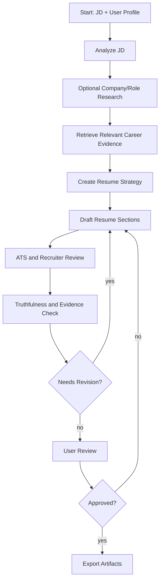
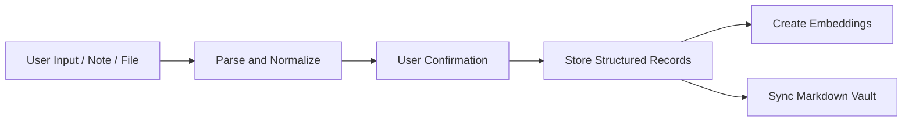
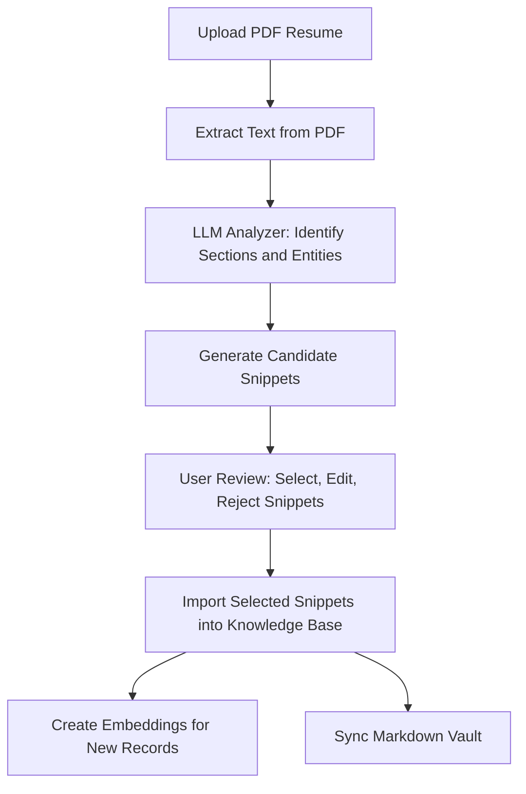
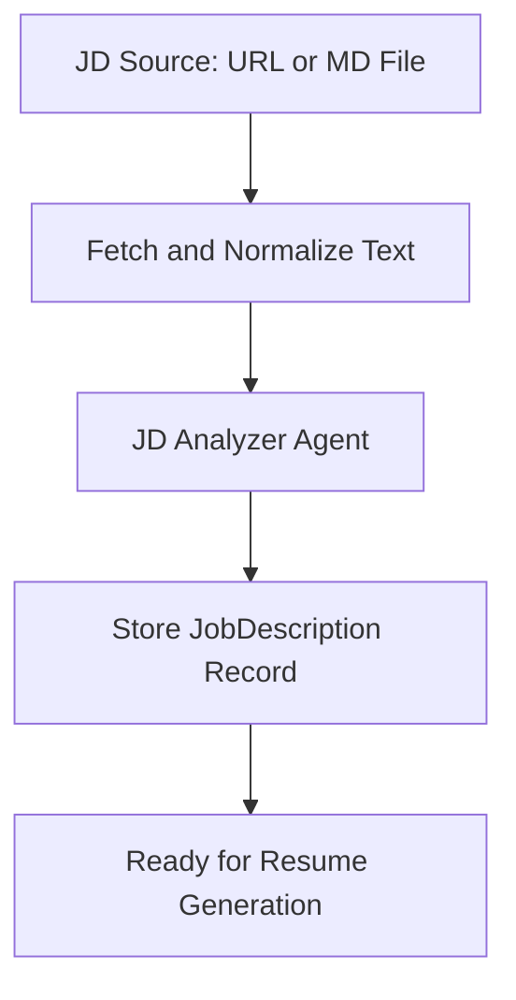

# Agent Workflows

## Workflow Principles

- Workflows should be explicit graphs, not hidden prompt chains.
- Each agent step should read and write typed state.
- Claims must be grounded in source records.
- The user must approve final content before export.
- Provider selection must be outside workflow logic.

## Main Resume Generation Workflow

## Agent State

The graph state should include:

- `job_description_id`
- `jd_analysis`
- `research_context`
- `retrieved_items`
- `resume_strategy`
- `draft_resume`
- `ats_review`
- `grounding_review`
- `user_edits`
- `export_requests`
- `errors`

## Stage Details

### 1. JD Analyzer

Input:

- Raw job description.
- Optional source URL.

Output:

- Job title.
- Seniority.
- Required skills.
- Preferred skills.
- Responsibilities.
- Domain keywords.
- ATS keywords.
- Company and role research queries.
- Potential red flags.

### 2. Research Step

Input:

- JD analysis.
- User-enabled search flag.

Tool:

- Tavily search provider.

Output:

- Company context.
- Product context.
- Role-specific signals.
- Market vocabulary.

The MVP can make this step optional to reduce API usage.

### 3. Retrieval Step

Input:

- JD analysis.
- Career profile records.

Output:

- Ranked positions.
- Ranked projects.
- Ranked achievements.
- Ranked skills.
- Evidence records.
- Coverage gaps.

Retrieval must use both vector similarity and keyword matching.

### 4. Resume Strategy Agent

Output:

- Target positioning.
- Recommended template.
- Section order.
- Skills emphasis.
- Experience emphasis.
- Project inclusion/exclusion.
- Keyword coverage plan.
- Risks and weak evidence notes.

### 5. Resume Writer Agent

Output:

- Header.
- Summary.
- Skills.
- Experience.
- Projects.
- Education.
- Certifications.
- Optional extras.

Every generated bullet should carry evidence IDs.

### 6. ATS and Recruiter Review Agent

Checks:

- Parseable section titles.
- Clear dates and titles.
- Keyword coverage.
- Overly dense wording.
- Unsupported acronyms.
- Repetition.
- Excessive length.
- Mismatch with target seniority.

### 7. Grounding Review Agent

Checks:

- Unsupported claims.
- Inflated metrics.
- Timeline inconsistency.
- Skills with no evidence.
- Claims that should be user-confirmed.

Output categories:

- `pass`
- `needs_user_confirmation`
- `unsupported`
- `contradiction`

### 8. Export Step

The export step only runs after user approval.

Outputs:

- Markdown.
- HTML.
- PDF.
- Word document.

## Supporting Workflows

### Career Profile Ingestion

### Resume PDF Ingestion

Purpose: allow the user to bootstrap their career knowledge base by uploading an existing resume in PDF format. The system extracts structured information and presents it as reviewable candidate snippets.

Workflow details:

1. **PDF Text Extraction**: Extract raw text from the uploaded PDF. Preserve section boundaries where detectable.
2. **LLM Analysis**: Pass the extracted text to an LLM with a structured output schema to identify candidate entities:
   - Contact information (name, email, phone, location, links).
   - Work experiences (company, title, dates, descriptions, tech stack).
   - Projects (title, role, summary, skills, outcomes).
   - Education (institution, degree, field, dates).
   - Certifications (name, issuer, date).
   - Skills (name, category, inferred proficiency).
   - Achievements (description, metrics if detectable).
3. **Candidate Snippets**: Each extracted item becomes a candidate snippet with a confidence label:
   - `high_confidence`: clear, well-structured, unambiguous.
   - `needs_review`: parsed but potentially incomplete or ambiguous.
   - `low_confidence`: detected but may need significant user correction.
4. **User Review**: Present candidates in a review UI. The user can:
   - Accept a snippet as-is.
   - Edit a snippet before accepting.
   - Reject a snippet.
   - Merge duplicate or overlapping snippets.
5. **Import**: Accepted snippets are created as structured records (Position, Project, Skill, Education, Certification, Achievement) in the database. Rejected snippets are discarded.
6. **Embed and Sync**: New records trigger embedding generation and Markdown vault sync, same as manual entry.

### JD Source Fetching

Purpose: allow the user to provide a job description via a website URL or a Markdown file upload, not just plain-text paste.

Workflow details:

1. **URL Fetching**: When the user provides a JD URL:
   - The backend fetches the URL content.
   - The raw HTML is converted to plain text (preserving headings and bullet structure).
   - The extracted text is stored in `raw_text` alongside the `source_url`.
   - If the URL is unreachable or non-HTML, return a clear error.
2. **Markdown File Upload**: When the user uploads a `.md` file:
   - The file is read as plain text and stored in `raw_text`.
   - The original file name is preserved for reference.
3. **JD Analyzer**: The normalized text feeds into the same JD Analyzer agent as a pasted JD.
4. **URL content must not override verified user career facts** — same rule as Tavily search results.

### Profile Gap Analysis

The agent can compare a target JD against the user's profile and report:

- Strong matches.
- Partial matches.
- Missing skills.
- Missing evidence.
- Suggested projects or stories to add.

## Prompt Versioning

Prompts should be stored as versioned templates. Prompt changes should be covered by regression tests against fixture career profiles and job descriptions.
