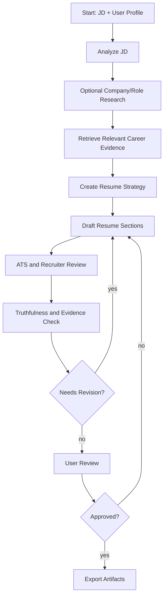
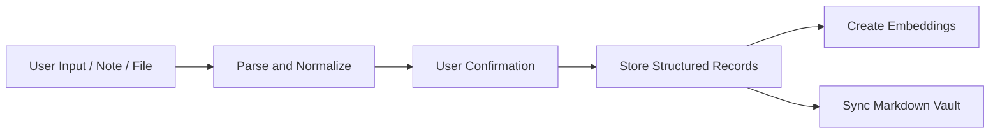
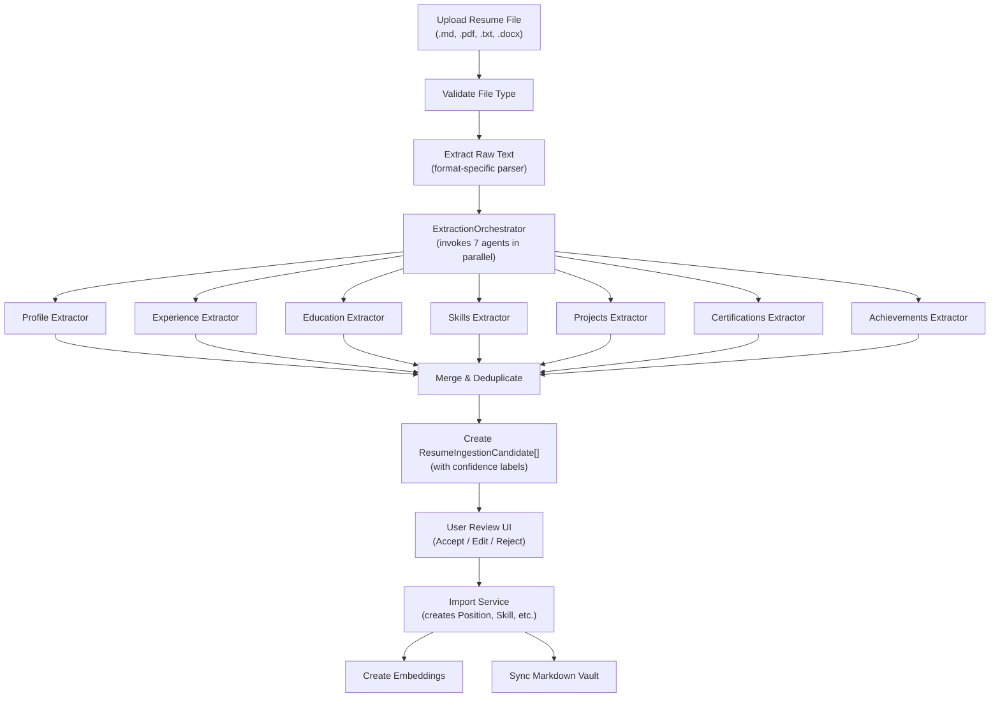
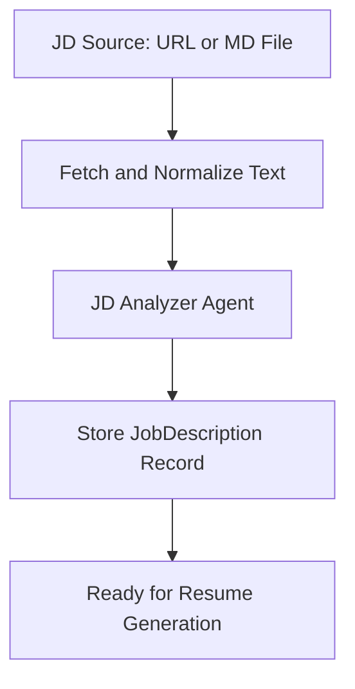

# Agent Workflows

> **Implementation Status (2026-06-04)**: The LangGraph workflow (`apps/api/app/agents/workflow.py`) is defined but **not yet wired** to Celery or any runtime. The `POST /api/resumes/{id}/generate` endpoint currently creates a minimal `ResumeVersion` with placeholder content as a synchronous fallback, which unblocks the export pipeline for MVP. Full agent-driven generation (JD analysis → retrieval → strategy → draft → ATS review → grounding) will be wired in a future phase when Celery task queue integration is complete.

## Workflow Principles

- Workflows should be explicit graphs, not hidden prompt chains.
- Each agent step should read and write typed state.
- Claims must be grounded in source records.
- The user must approve final content before export.
- Provider selection must be outside workflow logic.

## Main Resume Generation Workflow

## Agent State

The graph state should include:

- `job_description_id`
- `jd_analysis`
- `research_context`
- `retrieved_items`
- `resume_strategy`
- `draft_resume`
- `ats_review`
- `grounding_review`
- `user_edits`
- `export_requests`
- `errors`

## Stage Details

### 1. JD Analyzer

Input:

- Raw job description.
- Optional source URL.

Output:

- Job title.
- Seniority.
- Required skills.
- Preferred skills.
- Responsibilities.
- Domain keywords.
- ATS keywords.
- Company and role research queries.
- Potential red flags.

### 2. Research Step

Input:

- JD analysis.
- User-enabled search flag.

Tool:

- Tavily search provider.

Output:

- Company context.
- Product context.
- Role-specific signals.
- Market vocabulary.

The MVP can make this step optional to reduce API usage.

### 3. Retrieval Step

Input:

- JD analysis.
- Career profile records.

Output:

- Ranked positions.
- Ranked projects.
- Ranked achievements.
- Ranked skills.
- Evidence records.
- Coverage gaps.

Retrieval must use both vector similarity and keyword matching.

### 4. Resume Strategy Agent

Output:

- Target positioning.
- Recommended template.
- Section order.
- Skills emphasis.
- Experience emphasis.
- Project inclusion/exclusion.
- Keyword coverage plan.
- Risks and weak evidence notes.

### 5. Resume Writer Agent

Output:

- Header.
- Summary.
- Skills.
- Experience.
- Projects.
- Education.
- Certifications.
- Optional extras.

Every generated bullet should carry evidence IDs.

### 6. ATS and Recruiter Review Agent

Checks:

- Parseable section titles.
- Clear dates and titles.
- Keyword coverage.
- Overly dense wording.
- Unsupported acronyms.
- Repetition.
- Excessive length.
- Mismatch with target seniority.

### 7. Grounding Review Agent

Checks:

- Unsupported claims.
- Inflated metrics.
- Timeline inconsistency.
- Skills with no evidence.
- Claims that should be user-confirmed.

Output categories:

- `pass`
- `needs_user_confirmation`
- `unsupported`
- `contradiction`

### 8. Export Step

The export step only runs after user approval.

Outputs:

- Markdown.
- HTML.
- PDF.
- Word document.

## Supporting Workflows

### Career Profile Ingestion

### Resume Ingestion (Multi-format)

> **Implementation Status (2026-06-05)**: Design phase. Rule-based `_parse_markdown_sections()` is the current fallback. LLM-based extraction agents defined in [ADR 0003](adr/0003-llm-agent-extraction-strategy.md) and [Agent Pipeline Design](../docs/12-agent-pipeline-design.md).

Purpose: allow the user to bootstrap their career knowledge base by uploading an existing resume in any supported format (Markdown, PDF, TXT, DOCX). The system extracts structured information via LLM agents and presents it as reviewable candidate snippets.

Supported input formats:
- **Markdown** (`.md`): Direct text extraction, best results
- **Plain text** (`.txt`): Direct text extraction
- **PDF** (`.pdf`): Text extraction via PyPDF2/pdfplumber
- **Word** (`.docx`): Text extraction via python-docx

Workflow details:

1. **File Validation**: Check extension, MIME type, file size (< 10MB). Reject unsupported formats with clear error.
2. **Text Extraction**: Format-specific extraction to normalized UTF-8 text. Preserve section boundaries where detectable.
3. **LLM Extraction (parallel)**: Seven specialized extraction agents run concurrently. Each receives the full raw text and extracts its domain-specific entities. See [ADR 0003](adr/0003-llm-agent-extraction-strategy.md) for per-agent output schemas.
4. **Merge & Deduplicate**: Combine results from all agents. Resolve overlapping extractions (e.g., skill mentioned in both Skills section and Experience section).
5. **Candidate Snippets**: Each extracted item becomes a `ResumeIngestionCandidate` record with:
   - `entity_type`: mapped to DB entity type
   - `extracted_data`: full structured JSON from the agent
   - `confidence`: `high` / `medium` / `low` / `needs_review`
   - `status`: `pending` (awaiting user review)
6. **User Review**: Present candidates grouped by entity type in the review UI (`/ingestion/[id]`). User can accept, edit, reject, or merge candidates.
7. **Import**: Accepted candidates are created as structured records in the database. See `POST /api/ingestion/resume/{id}/import`.
8. **Embed and Sync** (future): New records trigger embedding generation and Markdown vault sync.

**Fallback behavior**: If LLM is unavailable, the system falls back to the rule-based `_parse_markdown_sections()` for Markdown/TXT files. PDF and DOCX without LLM return `status="processing"` with a message to try again when LLM is configured.

### JD Source Fetching

Purpose: allow the user to provide a job description via a website URL or a Markdown file upload, not just plain-text paste.

Workflow details:

1. **URL Fetching**: When the user provides a JD URL:
   - The backend fetches the URL content.
   - The raw HTML is converted to plain text (preserving headings and bullet structure).
   - The extracted text is stored in `raw_text` alongside the `source_url`.
   - If the URL is unreachable or non-HTML, return a clear error.
2. **Markdown File Upload**: When the user uploads a `.md` file:
   - The file is read as plain text and stored in `raw_text`.
   - The original file name is preserved for reference.
3. **JD Analyzer**: The normalized text feeds into the same JD Analyzer agent as a pasted JD.
4. **URL content must not override verified user career facts** — same rule as Tavily search results.

### Profile Gap Analysis

The agent can compare a target JD against the user's profile and report:

- Strong matches.
- Partial matches.
- Missing skills.
- Missing evidence.
- Suggested projects or stories to add.

## Prompt Versioning

Prompts should be stored as versioned templates. Prompt changes should be covered by regression tests against fixture career profiles and job descriptions.
