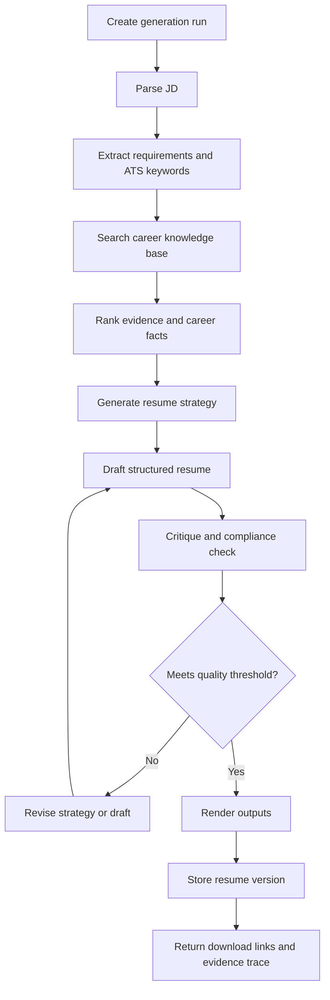

# Agent Workflows

## Workflow Principles

- Every important claim should be grounded in stored evidence.
- The agent should produce structured intermediate outputs.
- The user should be able to inspect selected evidence and revise the result.
- Generation should be retryable and auditable.

## Main Resume Generation Workflow

## LangGraph Nodes

### JD Analyzer

Inputs:

- raw job description
- optional source URL
- target role hints

Outputs:

- role title
- seniority
- required skills
- preferred skills
- responsibilities
- domain keywords
- ATS keyword list
- disqualifying gaps

### Retrieval Planner

Inputs:

- parsed JD
- user profile

Outputs:

- search queries
- filters
- requirement weights

### Career Retriever

Inputs:

- retrieval plan

Outputs:

- ranked experiences
- ranked projects
- ranked achievements
- ranked skills
- evidence references

### Resume Strategist

Inputs:

- parsed JD
- retrieval results

Outputs:

- target positioning
- section order
- skills emphasis
- included/excluded experience rationale
- risk mitigation notes

### Resume Writer

Inputs:

- strategy
- selected evidence
- template constraints

Outputs:

- structured resume document
- source references per section and bullet

### Resume Critic

Inputs:

- structured resume
- JD analysis
- evidence references

Outputs:

- truthfulness findings
- ATS keyword coverage
- readability issues
- repetition issues
- missing evidence
- revision instructions

### Export Renderer

Inputs:

- structured resume
- template
- requested formats

Outputs:

- Markdown
- HTML
- PDF
- DOCX

## Quality Gates

The workflow should block or warn when:

- a claim has no evidence reference
- dates conflict with stored career facts
- a required skill is claimed but not present in the profile
- generated content uses unsupported metrics
- ATS keyword coverage is low
- the resume is too long for the configured target length

## Human Review

The MVP should allow user review after generation. Future versions can support human-in-the-loop checkpoints before final export.

