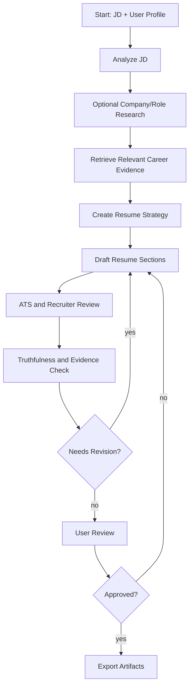
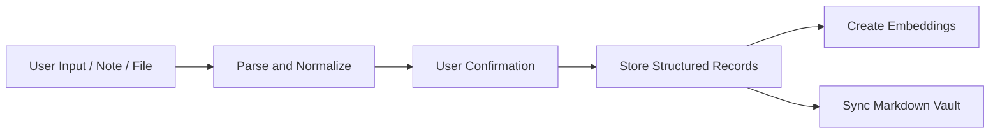

# Agent Workflows

## Workflow Principles

- Workflows should be explicit graphs, not hidden prompt chains.
- Each agent step should read and write typed state.
- Claims must be grounded in source records.
- The user must approve final content before export.
- Provider selection must be outside workflow logic.

## Main Resume Generation Workflow

## Agent State

The graph state should include:

- `job_description_id`
- `jd_analysis`
- `research_context`
- `retrieved_items`
- `resume_strategy`
- `draft_resume`
- `ats_review`
- `grounding_review`
- `user_edits`
- `export_requests`
- `errors`

## Stage Details

### 1. JD Analyzer

Input:

- Raw job description.
- Optional source URL.

Output:

- Job title.
- Seniority.
- Required skills.
- Preferred skills.
- Responsibilities.
- Domain keywords.
- ATS keywords.
- Company and role research queries.
- Potential red flags.

### 2. Research Step

Input:

- JD analysis.
- User-enabled search flag.

Tool:

- Tavily search provider.

Output:

- Company context.
- Product context.
- Role-specific signals.
- Market vocabulary.

The MVP can make this step optional to reduce API usage.

### 3. Retrieval Step

Input:

- JD analysis.
- Career profile records.

Output:

- Ranked positions.
- Ranked projects.
- Ranked achievements.
- Ranked skills.
- Evidence records.
- Coverage gaps.

Retrieval must use both vector similarity and keyword matching.

### 4. Resume Strategy Agent

Output:

- Target positioning.
- Recommended template.
- Section order.
- Skills emphasis.
- Experience emphasis.
- Project inclusion/exclusion.
- Keyword coverage plan.
- Risks and weak evidence notes.

### 5. Resume Writer Agent

Output:

- Header.
- Summary.
- Skills.
- Experience.
- Projects.
- Education.
- Certifications.
- Optional extras.

Every generated bullet should carry evidence IDs.

### 6. ATS and Recruiter Review Agent

Checks:

- Parseable section titles.
- Clear dates and titles.
- Keyword coverage.
- Overly dense wording.
- Unsupported acronyms.
- Repetition.
- Excessive length.
- Mismatch with target seniority.

### 7. Grounding Review Agent

Checks:

- Unsupported claims.
- Inflated metrics.
- Timeline inconsistency.
- Skills with no evidence.
- Claims that should be user-confirmed.

Output categories:

- `pass`
- `needs_user_confirmation`
- `unsupported`
- `contradiction`

### 8. Export Step

The export step only runs after user approval.

Outputs:

- Markdown.
- HTML.
- PDF.
- Word document.

## Supporting Workflows

### Career Profile Ingestion

### Profile Gap Analysis

The agent can compare a target JD against the user's profile and report:

- Strong matches.
- Partial matches.
- Missing skills.
- Missing evidence.
- Suggested projects or stories to add.

## Prompt Versioning

Prompts should be stored as versioned templates. Prompt changes should be covered by regression tests against fixture career profiles and job descriptions.
