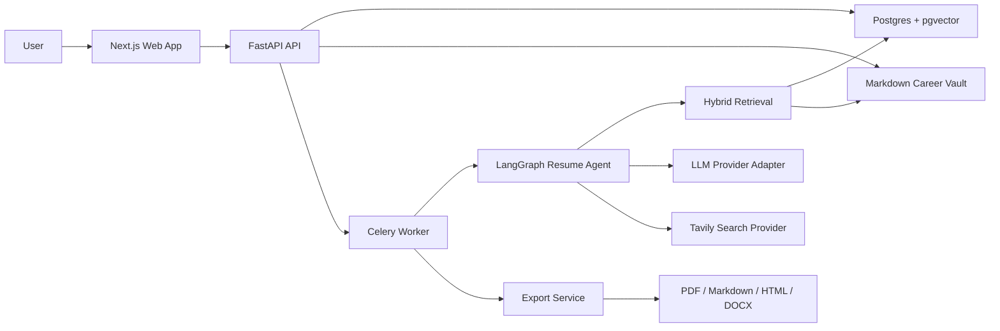
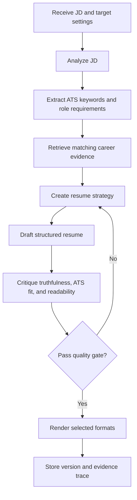

# CV Master Design Spec

Date: 2026-06-04

## Summary

CV Master is a local-first AI agent system that generates targeted, ATS-friendly resumes from a user's career knowledge base. The MVP is single-user and optimized for validating whether the system can produce high-quality resumes that increase the chance of getting recruiter screening calls. The architecture must remain extensible enough to evolve into a vertical personal career assistant agent.

## Goals

- Maintain a complete, searchable, auditable career profile.
- Generate resumes from a job description in PDF, Markdown, HTML, and DOCX.
- Tailor resume strategy, section ordering, skills emphasis, and experience bullets to each job.
- Preserve truthfulness by grounding resume claims in stored career facts and evidence.
- Support cloud and local LLM providers through configuration.
- Deploy locally through Docker with Postgres and Adminer.
- Use Tavily for MVP search while keeping search provider replacement simple.

## Non-Goals For MVP

- Multi-user SaaS, billing, or tenant management.
- Generic personal assistant functionality.
- Automated job application submission.
- Fully autonomous claims creation without user review.
- Enterprise access control or consultant workflows.

## Recommended Architecture

The system should be implemented as a monorepo with a FastAPI backend, Next.js frontend, Celery worker, Postgres database, Redis broker, and a local Markdown vault.

## Knowledge Base Decision

The recommended design is a hybrid of three patterns:

- Obsidian-like local Markdown vault for readability and user ownership.
- Mem0-like memory concepts for future assistant evolution.
- Enterprise knowledge-base retrieval patterns for hybrid search and evidence-backed answers.

For MVP, Postgres remains the source of truth and the Markdown vault acts as a local-readable companion layer. This gives the system both structured reliability and local-first usability.

## Backend Design

Use FastAPI for API routes and LangGraph for agent workflows. Keep LangGraph nodes thin: each node should call service interfaces for JD analysis, retrieval, strategy generation, writing, critique, and export.

Use Celery for slow tasks, including resume generation, embedding refreshes, search enrichment, and document export.

Use Pydantic Settings to read the active LLM provider from environment variables.

## Frontend Design

Use Next.js with TypeScript, Tailwind CSS, and shadcn/ui. The first screen should be the working application, not a landing page. Primary workflows:

- Career timeline and profile management
- Evidence/project library
- JD intake and analysis
- Resume generation workspace
- Resume preview and export
- Settings for LLM provider, Tavily key, and export preferences

## Data Model Overview

Core entities:

- CareerProfile
- WorkExperience
- Education
- Certification
- Project
- Skill
- Achievement
- EvidenceItem
- JobDescription
- ResumeGenerationRun
- ResumeVersion
- ResumeTemplate
- EmbeddingRecord

Generated resume content must store source references to evidence and career facts.

## Agent Workflow

## Provider Strategy

Required provider modes:

- `openai_compatible`
- `openai`
- `anthropic`
- `ollama`

The system should expose one internal chat/completion interface and one embedding interface. If a provider lacks embeddings, route embeddings to a configured embedding provider or local model.

## Deployment

Docker Compose should include:

- API service
- worker service
- web service
- Postgres with pgvector
- Redis
- Adminer

Adminer is required for database inspection during MVP development.

## Risks

- Resume hallucination: mitigate with evidence references and critique checks.
- ATS over-optimization: keep output readable to humans and avoid keyword stuffing.
- Local LLM quality variability: support provider-specific structured output retries.
- Export fidelity: verify PDF and DOCX templates with snapshot tests.
- Privacy: default to local-first storage, explicit provider configuration, and no hidden network calls.

## Acceptance Criteria

- A user can enter career data and evidence.
- A user can paste a JD and generate a tailored resume.
- The resume can be exported as PDF, Markdown, HTML, and DOCX.
- The generation record shows which facts/evidence were used.
- The user can configure cloud or local LLM providers through environment variables.
- The system runs locally through Docker Compose.

## References

- Obsidian stores notes as local Markdown files in a vault: https://obsidian.md/help/data-storage
- Mem0 provides managed and open-source memory layers for AI applications: https://docs.mem0.ai/
- FastAPI is a production-oriented Python API framework: https://fastapi.tiangolo.com/
- LangGraph supports agent orchestration patterns such as durable execution and human-in-the-loop workflows: https://docs.langchain.com/langgraph
- Tavily Search API is the MVP external search provider: https://help.tavily.com/articles/4840311948-tavily-search-api
- pgvector adds vector similarity search to Postgres: https://github.com/pgvector/pgvector

