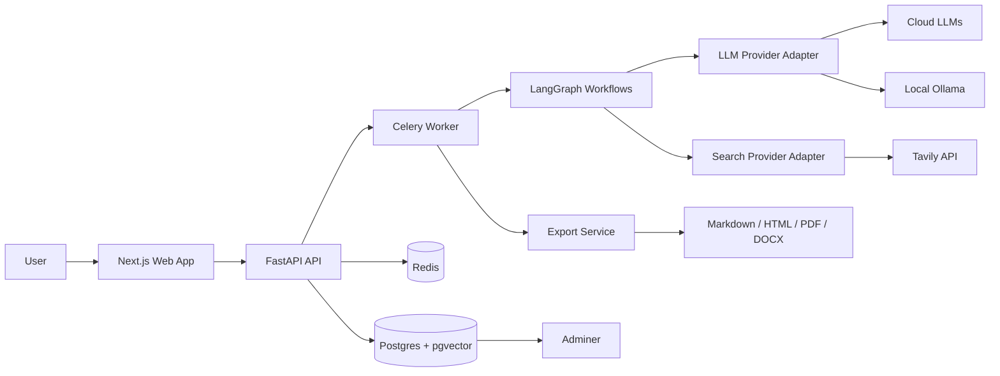
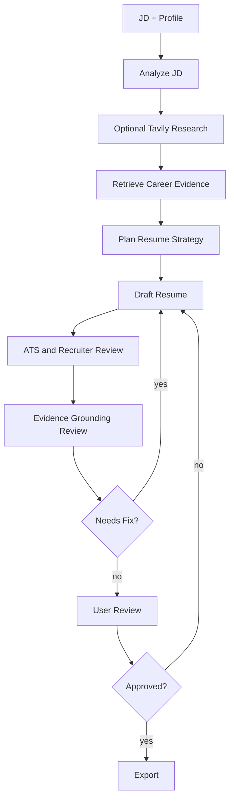

# CV Master Design Specification

Date: 2026-06-04

## 1. Overview

CV Master is a local-first AI agent for creating job-targeted resumes from a user's career knowledge base. The MVP is single-user and private-deployment oriented. The next phase should evolve toward a specialized personal career assistant similar in spirit to agentic personal tools, but focused on career workflows rather than generic autonomy.

The product must generate resumes that are suitable for ATS parsing and recruiter screening while remaining grounded in true user career data.

## 2. Product Goals

- Maintain a complete career knowledge base.
- Analyze job descriptions and identify role requirements.
- Retrieve the most relevant user experiences, projects, achievements, and skills.
- Generate targeted resumes in PDF, Markdown, HTML, and Word formats.
- Support cloud and local LLM providers through configuration.
- Keep generated claims traceable to evidence.
- Prepare the architecture for future career-assistant workflows.

## 3. MVP Scope

Included:

- Single-user local/private app.
- Career profile management.
- Structured career fact database.
- Local Markdown knowledge vault.
- JD analysis.
- Hybrid retrieval.
- Agentic resume generation.
- User review and editing.
- Multi-format export.
- Docker deployment with Postgres and Adminer.

Excluded:

- Multi-user SaaS.
- Billing.
- Teams.
- Recruiter CRM.
- Fully automated job applications.
- Generic personal assistant features.

## 4. Recommended Architecture



Backend:

- Python.
- FastAPI.
- LangGraph.
- SQLAlchemy 2.
- Alembic.
- Pydantic Settings.
- Celery.
- Redis.

Frontend:

- Next.js.
- React.
- TypeScript.
- Tailwind CSS.
- shadcn/ui.
- TanStack Query.
- Zustand.
- React Hook Form.
- Zod.

Data:

- Postgres.
- pgvector.
- PostgreSQL full-text search.
- Local Markdown vault.

## 5. Knowledge Base Design

Use a hybrid design:

- Postgres as the canonical structured fact store.
- Markdown vault as the human-readable local knowledge layer.
- pgvector for semantic retrieval.
- Full-text search for exact ATS keyword matching.

This is preferred over a pure Obsidian-style vault because resume generation requires structured dates, evidence, and relationships. It is preferred over a pure Mem0-style memory layer because resume claims must be auditable. QBrain/ZBrain-style enterprise knowledge systems are useful inspiration for document ingestion, but too broad for the MVP.

## 6. Core Data Entities

- UserProfile.
- Position.
- Project.
- Achievement.
- Skill.
- Education.
- Certification.
- Evidence.
- JobDescription.
- Resume.
- ResumeVersion.
- ResumeBulletEvidence.
- Embedding.

Generated resume bullets must reference supporting evidence IDs where possible.

## 7. Main Agent Workflow



## 8. LLM Provider Design

The system must support:

```env
LLM_PROVIDER=openai_compatible

OPENAI_COMPATIBLE_API_KEY=
OPENAI_COMPATIBLE_BASE_URL=https://api.deepseek.com
OPENAI_COMPATIBLE_MODEL=deepseek-v4-pro
OPENAI_COMPATIBLE_PROVIDER_NAME=deepseek

OPENAI_API_KEY=
OPENAI_MODEL=

ANTHROPIC_API_KEY=
ANTHROPIC_MODEL=

OLLAMA_BASE_URL=http://localhost:11434
OLLAMA_MODEL=

TAVILY_API_KEY=
```

Provider selection should be implemented through adapters:

- `openai_compatible`
- `openai`
- `anthropic`
- `ollama`

Agent workflows must call a common LLM interface.

## 9. Search Provider Design

Use Tavily for MVP. Encapsulate it behind a search provider interface so future providers can be added without changing agent workflow code.

Search is used for company and role context only. It must not override verified user career facts.

## 10. Frontend Experience

The app should be a focused workbench, not a marketing page.

Primary screens:

- Dashboard.
- Career Profile.
- Project Library.
- Skills Matrix.
- Evidence Library.
- Job Description Workspace.
- Resume Studio.
- Exports.
- Settings.

Resume Studio should show:

- JD requirements and strategy.
- Editable resume draft.
- Evidence links.
- ATS review notes.
- Export controls.

## 11. Deployment

Docker Compose should include:

- API.
- Web.
- Worker.
- Postgres.
- Redis.
- Adminer.

Recommended local URLs:

- Web: `http://localhost:3000`
- API: `http://localhost:8000`
- API docs: `http://localhost:8000/docs`
- Adminer: `http://localhost:8080`

## 12. Testing

Required test categories:

- Backend unit tests.
- Backend integration tests.
- Agent workflow fixture tests.
- Retrieval tests.
- Export tests.
- Frontend component tests.
- Playwright end-to-end tests.

Critical E2E path:

1. Create profile records.
2. Paste JD.
3. Analyze JD.
4. Generate resume.
5. Review evidence.
6. Edit and approve.
7. Export PDF and Markdown.

## 13. Development Phases

1. MVP foundation.
2. Career knowledge base.
3. JD analysis and retrieval.
4. Resume generation workflow.
5. Export system.
6. Quality and polish.
7. Specialized career assistant evolution.

## 14. Open Implementation Decisions

These should be resolved during implementation planning:

- Exact PDF rendering library.
- Exact Word document rendering library.
- Embedding model default for local and cloud providers.
- Whether to use Server-Sent Events or polling for job progress in MVP.
- Whether Markdown vault sync is automatic, manual, or both.

## 15. References

- FastAPI: https://fastapi.tiangolo.com/
- LangGraph: https://docs.langchain.com/oss/python/langgraph
- Next.js App Router: https://nextjs.org/docs/app
- Pydantic Settings: https://pydantic.dev/
- Celery: https://docs.celeryq.dev/en/stable/
- pgvector: https://github.com/pgvector/pgvector
- Adminer: https://www.adminer.org/
- Tavily API: https://docs.tavily.com/
- Obsidian data storage: https://help.obsidian.md/Files+and+folders/How+Obsidian+stores+data
- Mem0 documentation: https://docs.mem0.ai/
